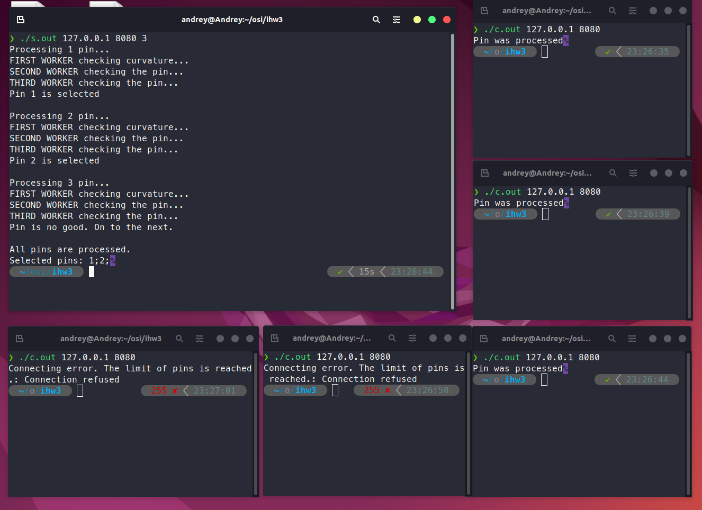

# Чижов Андрей Дмитриевич БПИ218
# ИДЗ-3 вариант 26
### условие задачи
```text
В цехе по заточке булавок все необходимые операции осуществляются тремя рабочими. Первый из них 
берет булавку и проверяет ее на предмет кривизны. Если булавка не кривая, то рабочий передает ее 
своему напарнику. Иначе выбрасывает в отбраковку. Напарник осуществляет собственно заточку и передает 
заточенную булавку третьему рабочему, который осуществляет контроль качества операции бракуя булавку 
или отдавая на упаковку. Требуется создать приложение, моделирующее работу цеха. Следует учесть, 
что каждая из операций выполняется за случайное время которое не связано с конкретным рабочим. 
Возможны различные способы реализации передачи (на усмотрение разработчика). Либо непосредственно
по одной булавке, либо через ящики, в которых буферизируется некоторое конечное количество булавок.
Каждый рабочий — отдельный клиент, осуществляющий входной контроль и заданную операцию. Сервер
осуществляет передачу булавок между соответствующей парой рабочих.

```
##
* Каждый клиент посылает серверу на обработку булавку.
* Булавки обрабатываются последовательно тремя рабочими.
* Каждый из рабочих может ее забраковать. 
* У каждого следующего рабочего вероятность забраковать булавку меньше предыдущего.
* Если булавка бракуется на любом этапе, начинает обрабатываться следующая.
## Пример работы программы.

## Запуск
Сервер запускается с указанием IP, порта и количества клиентов.
```bash
./server.out 127.0.0.1 8888 $num_of_clients
```
Клиенты запускаются с указаниме IP и порта.
```bash
./client.out 127.0.0.1 8888
```
