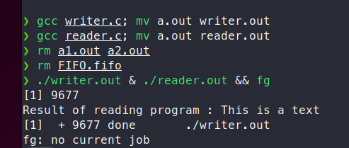

# ДР №5
Разработаны две программы, реализующие двусторонний обмен данными по именованному каналу.\
Их взаимодействие организовано, как взаимодействие независимых процессов.\
##
[reader.c](reader.c)\
[writer.c](writer.c)\
Создается FIFO.fifo\
\
Считывается строка:
```
This is a text
```
