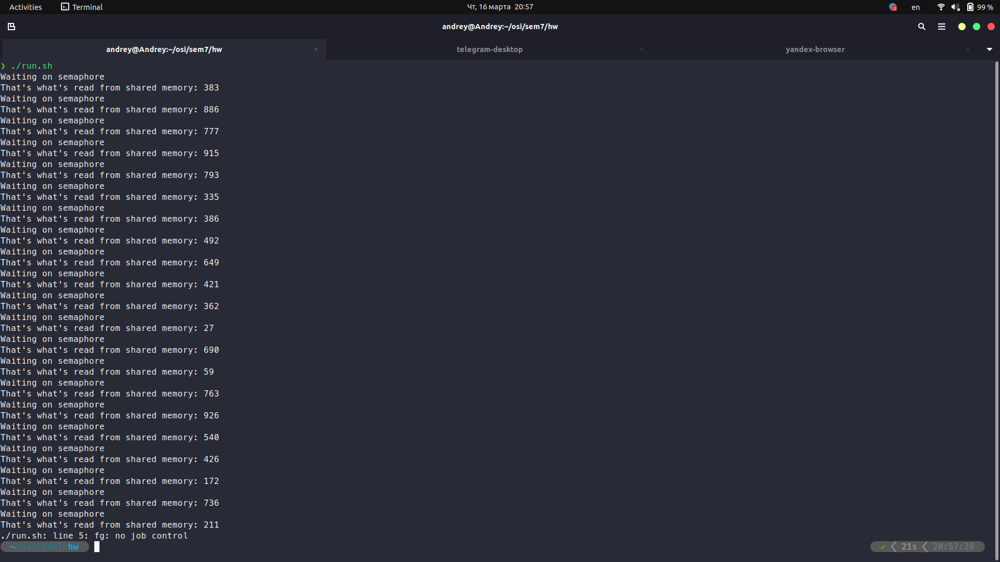

# ДР №7
Разработаны две программы: [клиента](1.c) и [сервера](2.c). С использованием функций POSIX. Клиент генерирует случайные числа, а сервер осуществляет их вывод.
##
Клиент создает семафоры. Генерирует случайные числа и записыает каждое в разделяемую память.\
Сервер считывает эти числа в виде строк из разделяемой памяти.
##
Пользуясь [скриптом](run.sh), запустим две программы одновременно.\
Ниже скриншот с выводом генерируемых значений в терминале.

